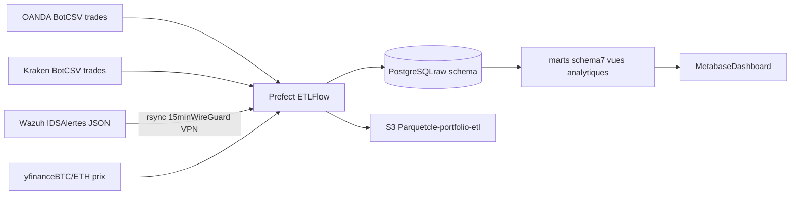

# Pipeline de données — Portfolio Data Engineering

> Pipeline ETL complet combinant des données de trading algorithmique (OANDA + Kraken) avec des alertes de sécurité Wazuh IDS, chargées dans un entrepôt PostgreSQL dimensionnel et visualisées dans Metabase.

     

## Métriques du projet

| | |
|---|---|
| 📊 Trades traités | 138 (OANDA + Kraken) |
| 🔒 Alertes Wazuh ingérées | 436 |
| ⏱️ Durée du pipeline ETL | ~3 secondes |
| 🗓️ Période de données | Avril 2026 (trading) · Mai 2026 (sécurité) |
| 🔄 Fréquence | Quotidien 06:00 UTC (ETL) · 15 min (sync alertes) |

## Architecture



## Tableau de bord

Le dashboard Metabase "Trading Bot Performance & Security Operations" inclut :

- **KPIs** : P&L total, taux de victoire, ratio de Sharpe, drawdown maximum, meilleur symbole, nombre de trades
- **Trading** : courbe d'équité, P&L quotidien par source, tendance du taux de victoire, distribution de durée des trades, heatmap P&L par heure × jour
- **Sécurité** : alertes dans le temps (par niveau), top sources d'attaque
- **Cross-domaine** : corrélation entre alertes Wazuh et exécutions de trades

> 💡 **Élément différenciateur** : le panneau "Security During Trading" corrèle les alertes IDS avec les timestamps d'entrée en position (fenêtre ±30 min). Cette jointure cross-domaine démontre pourquoi les deux sources de données sont combinées — et distingue ce portfolio de la majorité des projets ETL standards.


## Fonctionnalités

- **Pipeline ETL fiable** — Prefect flow avec validation, upserts idempotents, gestion d'erreurs et retry automatique
- **Double source de données** — trades OANDA (Forex) + Kraken (Crypto) normalisés dans un schéma unifié avec indicateurs techniques en JSONB
- **Entrepôt dimensionnel** — 7 vues `marts` couvrant performance trading, métriques de sécurité et benchmark marché
- **Backup S3 automatique** — exports Parquet quotidiens vers `s3://cle-portfolio-etl/`
- **Qualité des données** — validation à l'extraction : timestamps, nulls, types numériques — lignes invalides journalisées sans bloquer le flow
- **Benchmark de performance** — courbe d'équité du bot vs BTC/ETH buy-and-hold (données yfinance) — infrastructure prête, s'activera à pleine taille de position en trading live

## Défis techniques résolus

1. **Upserts idempotents** — contrainte UNIQUE sur `(trade_id, source)` permet de relancer le pipeline sans doublons, même si les CSVs se chevauchent
2. **Schéma unifié multi-bot** — OANDA et Kraken ont des colonnes d'indicateurs différentes ; colonnes communes en colonnes dédiées, indicateurs spécifiques en JSONB
3. **Transit sécurisé des alertes** — rsync chiffré via WireGuard VPN entre le serveur IDS et le Hub EC2, aucun port exposé à internet
4. **Jointure cross-domaine** — fenêtre temporelle ±30 min entre `entry_ts` des trades et `timestamp` des alertes Wazuh, sans clé de jointure directe

## Stack technique

| Couche | Technologie |
|--------|-------------|
| Orchestration | Prefect 2.x + systemd timer (06:00 UTC) |
| Transformation | Python · Pandas · SQL |
| Stockage | PostgreSQL 15 (AWS EC2) · S3 (Parquet) |
| Visualisation | Metabase v0.61 |
| Sécurité réseau | WireGuard VPN (tout le trafic chiffré) |
| Infrastructure | AWS EC2 · Ubuntu 22.04 · Docker |
| Tests | pytest (à venir) |

## Structure du projet

```
cle-portfolio/
├── etl/
│   ├── etl_pipeline.py      # Flow Prefect principal
│   └── sql/
│       └── marts.sql        # Vues analytiques (marts schema)
├── systemd/
│   ├── etl-pipeline.service # Service ETL quotidien
│   ├── etl-pipeline.timer   # Timer 06:00 UTC
│   ├── wazuh-rsync.service  # Sync alertes Wazuh → Hub EC2
│   └── wazuh-rsync.timer    # Timer toutes les 15 min
├── docs/
│   ├── schema.md            # Schéma des tables raw.*
│   ├── runbook.md           # Procédures opérationnelles
│   └── screenshots/
├── .env.example
├── requirements.txt
├── LICENSE
└── README.md
```

## Lancer le pipeline

```bash
# Cloner et configurer
git clone
cd cle-portfolio
pip install -r requirements.txt
cp .env.example .env  # remplir les valeurs

# Lancer manuellement
python etl/etl_pipeline.py

# Vérifier le timer systemd
systemctl status etl-pipeline.timer
```

Voir [`docs/runbook.md`](docs/runbook.md) pour les procédures de diagnostic et récupération.

## Roadmap

- [ ] Enrichissement géo des IPs (MaxMind GeoLite2) → carte des sources d'attaque
- [ ] Mapping MITRE ATT&CK des règles Wazuh
- [ ] MTTD et temps de résolution des alertes
- [ ] Tests unitaires pytest sur les transformations ETL
- [ ] dbt pour la couche marts (Project 2)

## Schéma des données

Voir [`docs/schema.md`](docs/schema.md) pour la définition complète des tables `raw.trades` et `raw.wazuh_alerts`.

## Auteur

Projet portfolio démontrant des compétences en ingénierie de données end-to-end, initialement développé pour une candidature en ingénierie de données.
Infrastructure de sécurité sous-jacente : WireGuard VPN · Wazuh IDS · CrowdSec · Suricata · AWS EC2.
